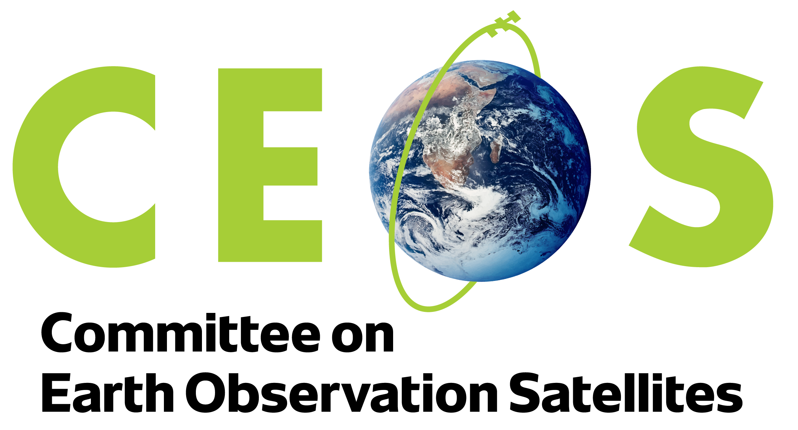

# CEOS Interoperability Handbook 2.0

Enhancing Interoperability of data and services between different Earth Observation stakeholders

**This document is now a first draft, and open for community review. Please use [Discussion](https://github.com/ceos-org/interoperability-handbook/discussions) section to provide your comments and feedback, and raise any Actions under [Issues](https://github.com/ceos-org/interoperability-handbook/issues)**

## Table of Contents

- [**1. Introduction**](Introduction.md)
- [**2. Interoperability Framework**](Framework.md)
- [**3. Vocabulary (Semantics)**](Vocabulary.md)
- [**4. Architecture**](Architecture.md)
- [**5. Interface**](Interface.md)
- [**6. Quality**](Quality.md)
- [**7. Policy**](Policy.md)
- [**8. Conclusion and Future Scope**](Conclusion.md)

## License

Content in this repository is accessible under the [CC-BY 4.0 license](LICENSE).

## Contributors
Overall Coordination (WGISS), Tom Sohre (USGS), Nitant Dube (ISRO), Libby Rose

Factor Leads: 
**Vocabulary** (LSI-VC) Peter Strobl (EU Commission)
**Architecture** (SEO and WGISS) Alex Lith (Auspatious), Mirko Albani (ESA)
**Interface** (WGISS) Damiano Guerrucci (ESA)
**Quality** (WGCV) Cody Anderson (USGS), Medhavy Thankappan (GA)
**Policy** (CEO, SEO, WGISS, WGCV)

Public Review: OGC, CEOS COAST-VC, NASA, UKSA, UK NPL, DLR, NOAA
***
[NEXT](Introduction.md)
