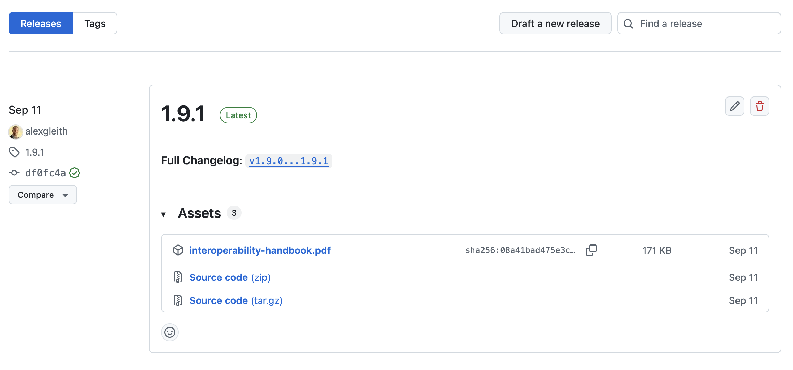

# Publishing the Interoperability Handbook

This document outlines the way that we can publish a released version of the Interoperability
Handbook document.

## Structure and process

The process uses LaTEX to produce a PDF, converting the markdown documents. Content is gathered
from the markdown documents, and the Python script [generate_pdf.py](generate_pdf.py) does
the work of aggregating and adds some formatting.

The process is triggered with a [GitHub Action](../.github/workflows/pdf-on-release.yml).

Note that currently the version uses a software practice called "[semantic versioning](https://semver.org/)"
, which has a structure of `major`.`minor`.`patch` release. We could simply use something like `2.0` too.

There are two ways of building a PDF document:

1. One every push to the `main` branch there is a build artifact created, which can be accessed through
   the [Actions](https://github.com/ceos-org/interoperability-handbook/actions/workflows/pdf-on-release.yml) section on GitHub
2. On release, a release asset is published, which can be accessed in the [Release](https://github.com/ceos-org/interoperability-handbook/releases) section on GitHub.

## How to publish a new release

To publish a release, use the GitHub user interface and to the following:

1. Go to the [Releases section](https://github.com/ceos-org/interoperability-handbook/releases)
2. Click "Draft a new release"
3. Click the "Tag" and write a new tag, in the agreed version schema (e.g., `2.0.0`) and
   change the release title to the same thing (e.g., `2.0.0`)
4. Enter release notes, or click the "Generate release notes" button and edit
5. Click "Publish release."

Once created, you can see the progress of the PDF creation in the
[Actions](https://github.com/ceos-org/interoperability-handbook/actions) section. When this
workflow completes, you will see the PDF as a release asset (see example image below).

